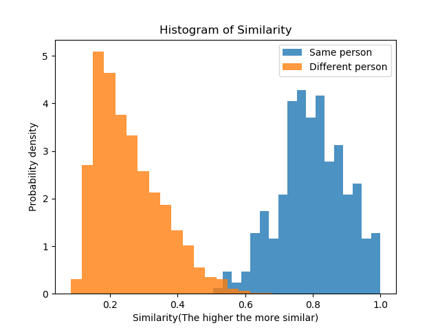
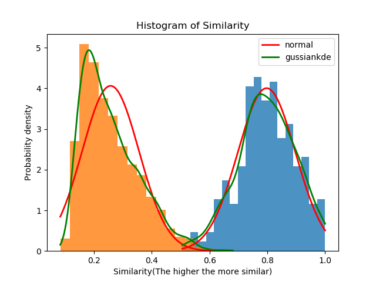
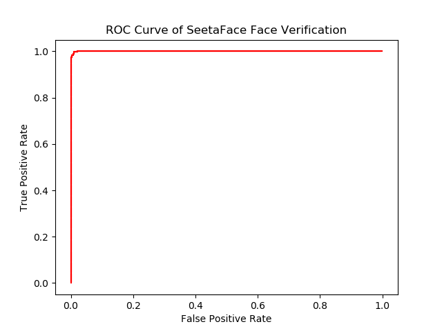

# 测试SeetaFace中人脸相似度模块用于身份验证的效果
## 环境
SeetaFace

OpenCV

Matplotlib

## 各个文件的作用

* `verification.cpp` 用于生成相似度值并保存在outdata.txt中

* `py.py` 使用matplotlib进行画图

* `datalist.txt` data目录下的所有图片名字 

## 实验结果

均衡过后的直方图分布

拟合正态分布曲线

ROC曲线

## 结论

SeetaFace用于简单的身份验证的效果较好，取相似度阈值为0.6左右的时候效果较好
